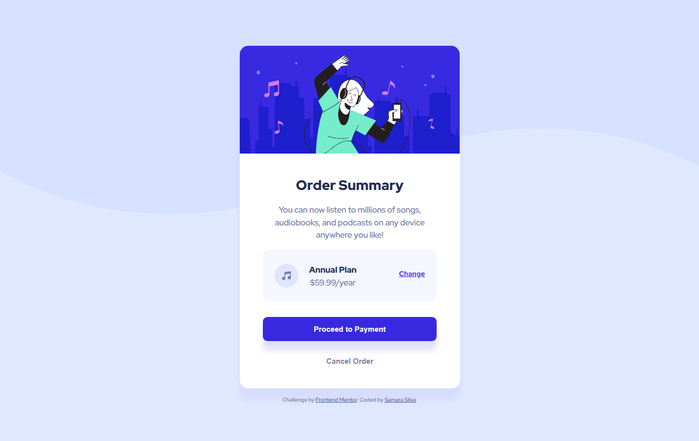

# Frontend Mentor - Order summary card solution

This is a solution to the [Order summary card challenge on Frontend Mentor](https://www.frontendmentor.io/challenges/order-summary-component-QlPmajDUj). Frontend Mentor challenges help you improve your coding skills by building realistic projects. 

## Table of contents

- [Overview](#overview)
  - [The challenge](#the-challenge)
  - [Screenshot](#screenshot)
  - [Links](#links)
- [My process](#my-process)
  - [Built with](#built-with)
  - [What I learned](#what-i-learned)
  - [Continued development](#continued-development)
  - [Useful resources](#useful-resources)
- [Author](#author)

## Overview

In this README I go over my process of development for this challenge, the things I learned and the tools I used trying to get my page as close to the design as possible.

### The challenge

Users should be able to:

- See hover states for interactive elements

### Screenshot




### Links

- Solution URL: [Solution](https://www.frontendmentor.io/)
- Live Site URL: [Site](https://samarasilva18.github.io/order-summary-component/)

## My process

1. This project was largely just for practicing concepts I already knew, and it was pretty chill and quick to do. First I structured the HTML elements, the main, divs, paragraphs, titles and so on. 
2. I went with a mobile-first approach, using flexbox for the main element, with flex-direction: column. That results in a component where the elements inside are organized vertically, which looks nice on mobile!
3. From there, I started stylizing the component from top down. The image, then the paragraph, the prices div, and so on.
4. Then, I built the hover states for all interactive elements.
5. After that, I used the @media functionality to make the desktop version for the component!
6. I wrote this README.
7. And finally I created a repository and uploaded the project to Github!

### Built with

- CSS custom properties
- Flexbox
- Mobile-first workflow

### What I learned

I learned about using images as backgrounds in this project! It was interesting trying to figure that out, I had no idea what to do at first but fiddled until I found something that worked somewhat nicely. I'm not sure if it matches the design exactly, but I figured it looked close enough!

```css
body {  
  background-image: url(images/pattern-background-mobile.svg);
  background-repeat: no-repeat; 
}
```

### Continued development

I finished this surprisingly quickly, so I'm seriously thinking about using a completely new framework or tool in the next challenge I take, since I think it'll teach me more than trying to solve it with pure CSS and HTML like I've been doing so far!

### Useful resources

- [How to set box shadow only at bottom in CSS?](https://linuxhint.com/set-box-shadow-only-at-bottom-css/#:~:text=To%20display%20the%20shadow%20at,to%20display%20is%20also%20set.) - This really helped me make the shadows on each element look the way I wanted them to! Recommended if you're struggling with putting the shadow only on the bottom like I was.
- [CSS Background-Image Property](https://www.w3schools.com/cssref/pr_background-image.php) - This helped me figure out how to put an image as the background and make it stop repeating itself!

## Author

- Frontend Mentor - [@samarasilva18](https://www.frontendmentor.io/profile/samarasilva18)
- Github - [samarasilva18](https://github.com/samarasilva18)